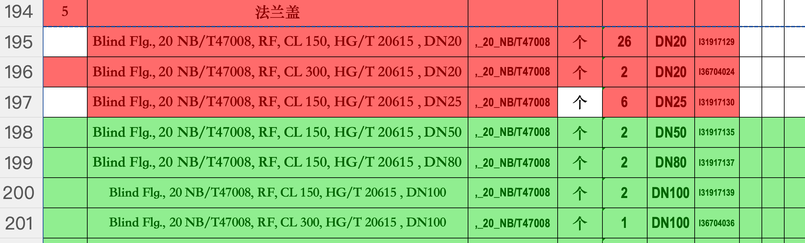

# Excel 文件对比工具

[English](README.md) | [中文](README.zh-CN.md)

一个强大的 Excel 文件对比工具，可以检测Excel 文件之间的变化并生成详细的变更记录。

## 功能特性

- ✅ **单元格级别对比**：检测新增、删除和修改
- 📊 **多工作表支持**：对比工作簿中的所有工作表
- 🎯 **灵活的对比模式**：
  - 忽略大小写
  - 修剪空白字符
  - 忽略空单元格
- 📝 **多种输出格式**：文本、JSON、Markdown、CSV
- 🚀 **CLI 接口**：便捷的命令行使用
- 🌐 **Web 界面**：现代化、用户友好的 Web UI
- 🖥️ **桌面应用**：跨平台 Electron 桌面应用程序

## 安装

```bash
npm install
npm run build
```

## 使用方法

### Web 界面

启动 Web 服务器：

```bash
npm run web
```

然后在浏览器中打开 http://localhost:3000

功能特性：

- 拖拽上传文件
- 多目标文件对比
- 实时对比选项
- 多种格式下载结果
- 复制结果到剪贴板

**界面截图：**

### 上传和配置界面


### 对比结果展示



### Electron 桌面应用

启动 Electron 桌面应用：

```bash
# 开发模式
npm run electron:dev

# 或者构建后运行
npm run build:all
npm run electron:start
```

功能特性：
- 原生桌面体验
- 文件菜单快速选择文件
- 键盘快捷键 (Ctrl+O, Ctrl+Shift+O)
- 内置 Excel 预览
- 与 Web 界面相同的功能

### 构建桌面应用

```bash
# 构建当前平台
npm run dist

# 构建 Windows 版本
npm run dist:win

# 构建便携版
npm run dist:portable
```

### 命令行

```bash
# 使用文本输出对比文件
npx ts-node src/cli.ts base.xlsx target1.xlsx target2.xlsx

# 以指定格式输出到文件
npx ts-node src/cli.ts base.xlsx target.xlsx -o changes_{name}.md -f markdown

# 忽略大小写和空单元格
npx ts-node src/cli.ts base.xlsx target.xlsx --ignore-case --ignore-empty

# 导出为 CSV
npx ts-node src/cli.ts base.xlsx target.xlsx -o changes_{name}.csv -f csv
```

### 编程方式使用

```typescript
import { ExcelReader, ExcelComparator, ChangeRecordGenerator } from './src'

const reader = new ExcelReader()
const comparator = new ExcelComparator({ ignoreEmptyCells: true })
const generator = new ChangeRecordGenerator()

// 读取 Excel 文件
const baseData = await reader.readFile('base.xlsx')
const targetData = await reader.readFile('target.xlsx')

// 对比文件
const changes = comparator.compare(baseData, targetData)

// 生成变更记录
const record = comparator.createChangeRecord('target.xlsx', changes)

// 以所需格式输出
const textOutput = generator.generateText(record)
console.log(textOutput)
```

## 对比选项

| 选项         | CLI 标志         | 描述                     |
| ------------ | ---------------- | ------------------------ |
| 忽略大小写   | `--ignore-case`  | 不区分大小写的文本对比   |
| 修剪空白     | `--no-trim`      | 不修剪空白（默认：true） |
| 忽略空单元格 | `--ignore-empty` | 在对比中跳过空单元格     |

## 输出格式

- **text**（默认）：带 emoji 指示符的人类可读文本
- **json**：用于程序处理的结构化 JSON
- **markdown**：用于文档的格式化 Markdown
- **csv**：用于数据分析的逗号分隔值

## 开发

```bash
# 运行测试
npm test

# 运行测试并生成覆盖率报告
npm test -- --coverage

# 类型检查
npm run type-check

# 代码检查
npm run lint

# 代码格式化
npm run format
```
